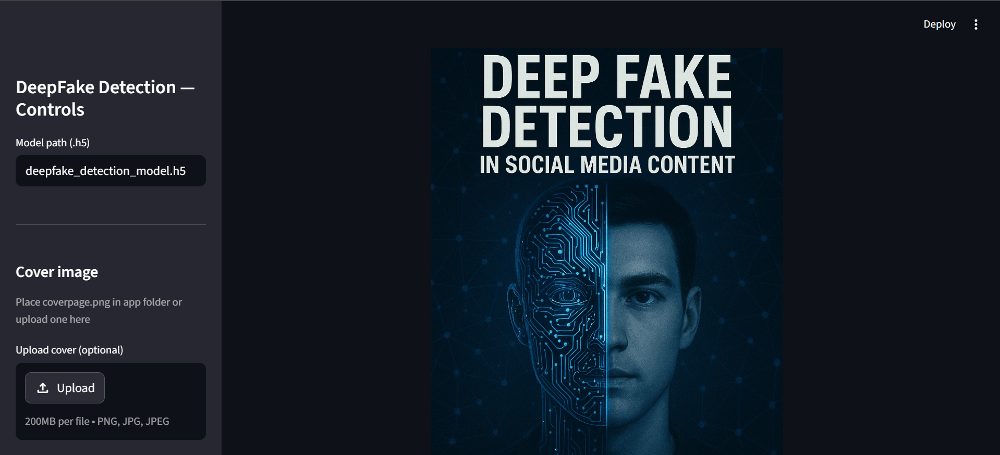
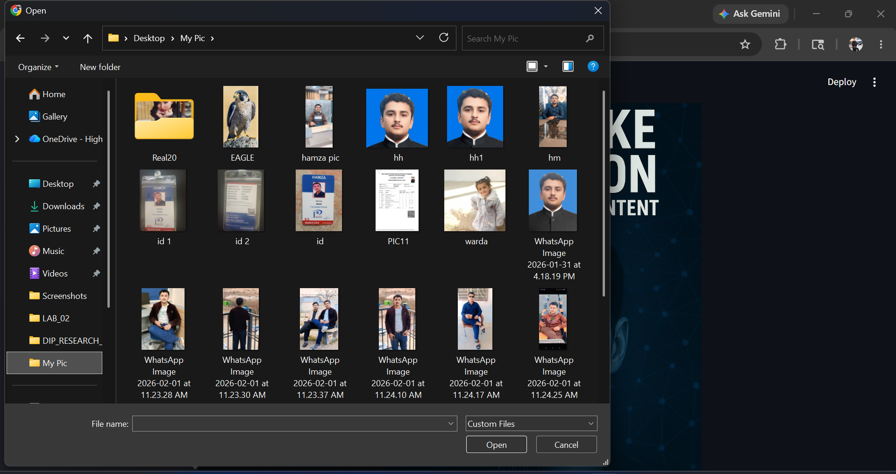
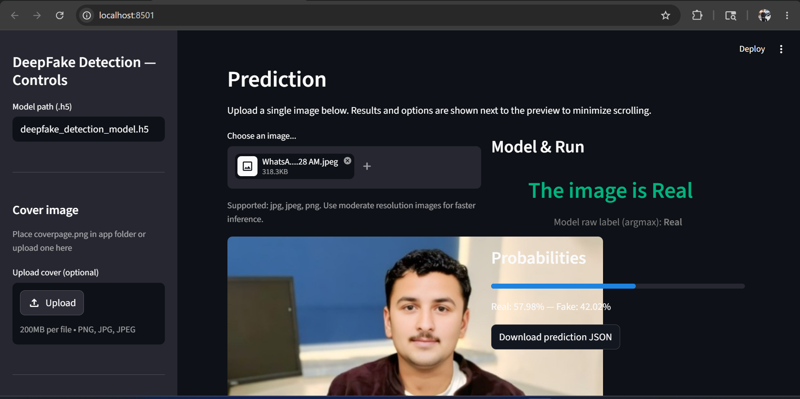

# 🛡️ DeepFake Detection

> **AI-Powered DeepFake Detection System using Deep Learning, Computer Vision, TensorFlow, OpenCV, and Streamlit**

---

## 📌 Project Overview

DeepFake Detection is a deep learning application designed to identify AI-generated or manipulated facial images using Convolutional Neural Networks (CNNs). The system analyzes uploaded images and predicts whether they are **Real** or **Fake**, providing confidence scores through an interactive Streamlit interface.

This project demonstrates practical applications of:

- Deep Learning
- Computer Vision
- Image Classification
- AI Media Authentication
- Real-Time AI Inference
- Streamlit Web Applications

---

# ✨ Features

- 🔍 Real-Time DeepFake Image Detection
- 🧠 CNN-Based Image Classification
- 📊 Prediction Confidence Score
- 🖼️ Image Upload and Preview
- ⚡ Fast AI Inference
- 🎨 Interactive Streamlit Dashboard
- 📁 Downloadable Prediction Results
- 📈 Performance Visualization
- 💻 User-Friendly Interface

---

# 🖼️ Project Preview

## Dashboard



---

## Detection Interface



---

## Prediction Result



---

# 🧠 Deep Learning Workflow

```text
Input Image
      │
      ▼
Image Preprocessing
      │
      ▼
CNN Deep Learning Model
      │
      ▼
Feature Extraction
      │
      ▼
Classification Layer
      │
      ▼
Real / Fake Prediction
      │
      ▼
Confidence Score
```

---

# ⚙️ Technologies Used

| Technology | Purpose |
|------------|---------|
| Python | Core Programming |
| TensorFlow | Deep Learning Framework |
| OpenCV | Image Processing |
| CNN | Image Classification |
| Streamlit | Web Application |
| NumPy | Numerical Computation |
| Pillow (PIL) | Image Handling |

---

# 📂 Project Structure

```text
DeepFake-Detection/
│
├── app.py
├── predict.py
├── train.py
├── deepfake_detection_model.h5
├── requirements.txt
├── README.md
├── cover.png
│
└── assets/
    ├── dashboard.png
    ├── detection.png
    ├── prediction.png
    └── analytics.png
```

---

# 🚀 Installation

## 1️⃣ Clone the Repository

```bash
git clone https://github.com/hamzaharoon-ai/DeepVision-AI.git
```

---

## 2️⃣ Navigate to the Project Directory

```bash
cd DeepVision-AI
```

---

## 3️⃣ Install Dependencies

```bash
pip install -r requirements.txt
```

---

## 4️⃣ Launch the Application

```bash
streamlit run app.py
```

---

# 📸 Supported Image Formats

- JPG
- JPEG
- PNG

---

# 📊 Model Information

| Feature | Details |
|---------|----------|
| Model | Convolutional Neural Network (CNN) |
| Framework | TensorFlow |
| Task | Binary Image Classification |
| Classes | Real / Fake |
| Inference | Real-Time |

---

# 📈 Future Improvements

- 🎥 Real-Time Webcam Detection
- 🎬 DeepFake Video Detection
- 🤖 Vision Transformer (ViT) Models
- 📊 Explainable AI (Grad-CAM)
- ☁️ Cloud Deployment
- 🌐 REST API Integration
- 🔐 User Authentication
- 📱 Mobile Application
- 📦 Docker Support

---

# 👨‍💻 Developer

## Hamza Haroon

Artificial Intelligence Student passionate about developing intelligent systems using:

- Machine Learning
- Deep Learning
- Computer Vision
- Natural Language Processing
- Generative AI
- AI Automation

My goal is to build practical AI applications that solve real-world problems while continuously improving my research and software engineering skills.

---

# 📬 Contact

**GitHub**

https://github.com/hamzaharoon-ai

**LinkedIn**

https://www.linkedin.com/in/hamzaharoonai

**Email**

hamzamehmoodkhan1245@gmail.com

---

# 📜 License

This project is released for educational, research, and portfolio purposes.

---

# ⭐ Support

If you found this project useful, consider giving it a ⭐ on GitHub.

Contributions, suggestions, and feedback are always welcome.

---

> **DeepFake Detection** demonstrates the practical application of Deep Learning and Computer Vision techniques for detecting AI-generated facial images, providing a foundation for research and real-world AI media authentication systems.
